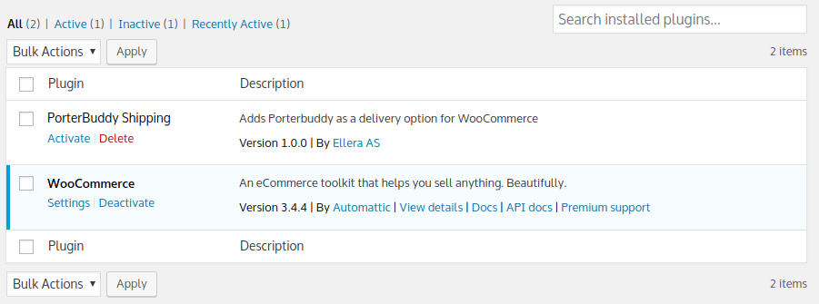
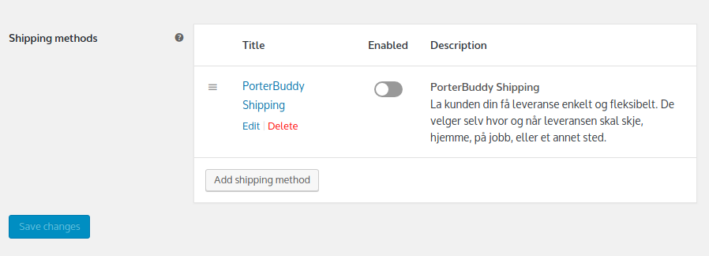
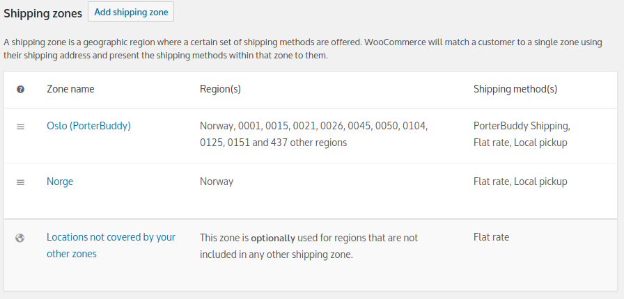

#Installing PorterBuddy
###Plugin Requirements:
1.  Wordpress (Developed with v4.9.8)
2.  WooCommerce (Developed with v3.4.4)

###Install Instructions:
1.  Clone this repo and copy the directory `porterbuddy-wc` into your plugins folder `/wp-content/plugins/`.
2.  Navigate to `Administration Panel` -> `Plugins` in a browser and activate "PorterBuddy Shipping"

3.  Navigate to `Administration Panel` -> `WooCommerce` -> `Settings` -> `Shipping` -> `PorterBuddy Shipping` and configure the settings. You will need an API Key for MapBox to utilize HTML5 Geolocation.
4.  Navigate to `Administration Panel` -> `WooCommerce` -> `Settings` -> `Shipping` and select the zone named "Oslo (PorterBuddy)" and enable PorterBuddy Shipping for this zone. 

You must also add any other shipping method that should be available in Oslo to this zone, WooCommerce selects the first zone matching a customer starting from the top - so a customer with postal code matching this zone will not get any other shipping choices.

(Tip: If you accidentally delete this zone, deactivate and reactivate the plugin will recreate the zone with the postal codes.)
5.  PorterBuddy Shipping should now be available to your customers that match the zone.

